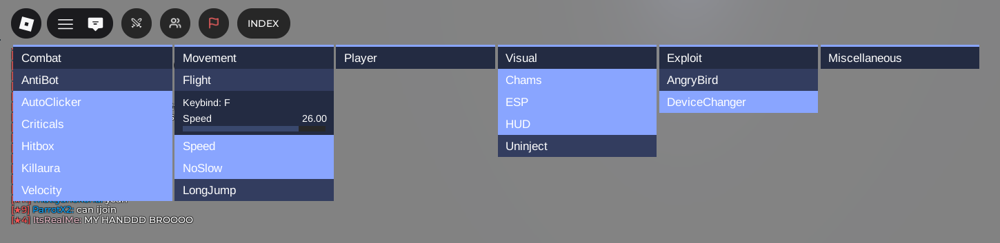
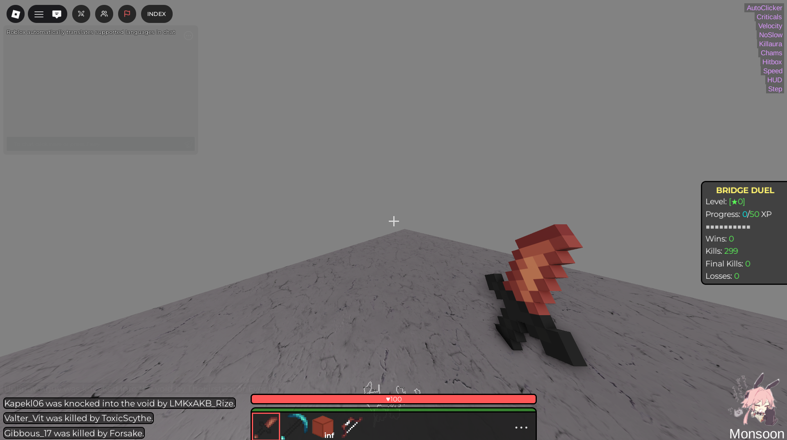

<p align="center">
  
</p>

## MonsoonForRoblox
Monsoon was a Minecraft hacked client previously available on [intent.store](https://intent.store/) and [monsoon.wtf](https://web.archive.org/web/20231211032353/https://monsoon.wtf/) before it was eventually ratted and later discontinued. This time, it’s back on Roblox for Minecraft styled games, made purely for fun. This project is heavily inspired by [VapeV4ForRoblox](https://github.com/7GrandDadPGN/VapeV4ForRoblox/tree/main), and the original discontinued [Monsoon project](https://web.archive.org/web/20231211032353/https://monsoon.wtf/).

#### Interface



#### Games
- Bridge Duel
- Bed Fight
- Bedwars
- Skywars

#### Script
```luau
loadstring(game:HttpGet("https://raw.githubusercontent.com/not-hm/MonsoonForRoblox/refs/heads/main/loader.lua", true))()
```
Note: Still in development
Contact: https://discord.gg/vbaKx8UWU9
